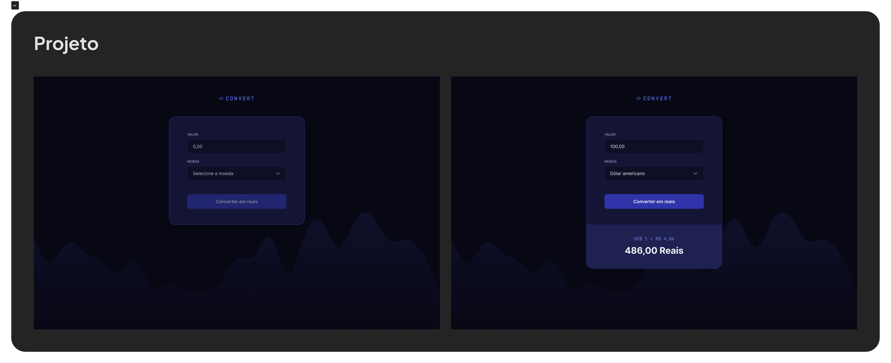

# Convert

___

Uma aplicação web simples e eficiente para conversão de moedas, desenvolvida com JavaScript. O sistema permite que os usuários insiram um valor e escolham entre dólar, euro ou libra para converter diretamente para a moeda brasileira, com um design intuitivo e funcional.

---

## Sobre o Projeto

O **Convert** foi criado com o objetivo de proporcionar uma ferramenta prática e rápida para conversão de moedas. Este projeto é ideal para quem deseja aprender ou demonstrar habilidades em manipulação de formulários, eventos no DOM e exibição condicional de elementos.

---

## Funcionalidades

- **Conversão de Moedas:** 
  - O usuário insere um valor e escolhe entre as moedas: **dólar**, **euro** ou **libra**.
  - O programa realiza a conversão para **real brasileiro (BRL)** com base na moeda selecionada.
- **Exibição Dinâmica:** 
  - Um `footer` oculto é ativado automaticamente após a conversão, exibindo o valor convertido.
- **Interface Simples:** 
  - Design clean e intuitivo, adequado para uso em diferentes dispositivos.
- **Cálculos Precisos:** Baseado em taxas fixas de conversão (ou integração com API de taxas de câmbio, caso desejado futuramente).

---

## Tecnologias Utilizadas

- **HTML5:** Estrutura da página.
- **CSS3:** Estilização e responsividade.
- **JavaScript:** Implementação da lógica de conversão e manipulação do DOM.

---

## Demonstração do Projeto

Veja abaixo uma prévia do layout do projeto:

---

## Como Executar o Projeto

Feito com :heart: por Tiago Marques.